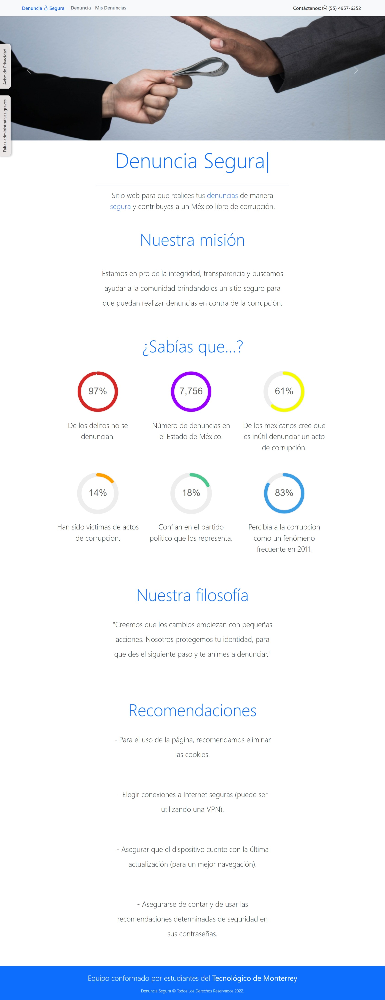
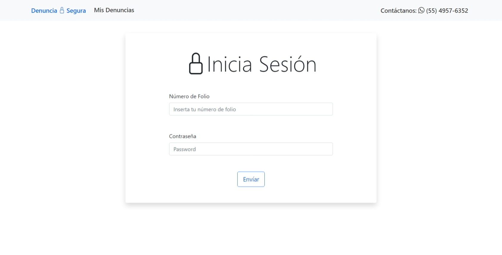
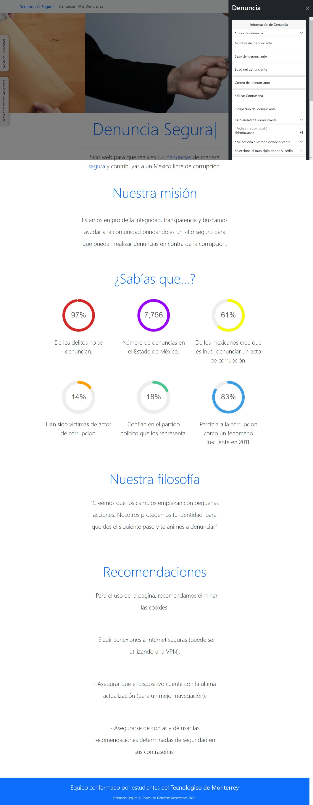

#  Hackaton Discorruption 2022 - Final Solution by the Team: <i>"Los Anonimos"</i>

## Description
The main objective of the contest was to deliver a digital solution that helps to reduce corruption in Mexico, providing a platform that provides an easy way to report any corruption case identified by any citizen. 

## Main Learnings 
* Team Work
* Work Underpressure
* Critical Thinking
* Software Design
* Work Team Management
* Assertive Communication
* SQL 
* PHP
* HTML/CSS

## Installation
* Install XAMPP on your local machine
* Download the repository and locate the <i>"anonimos"</i> directory inside the <i>"htdocs"</i> of the XAMPP program files.
* Run the <i>SQL</i> and <i>APACHE</i> servers
* Open the phpMyAdmin platform located in <i>SQL admin</i> button.
* Create a database named <i>"denunciasegura"</i>
* Copy the code of <i>"denunciasegura.sql"</i> on the SQL command line inside the database previusly created
* Now you can see and test the solution located on <i>localhost/anonimos/index.php</i>

## Screenshots
  

